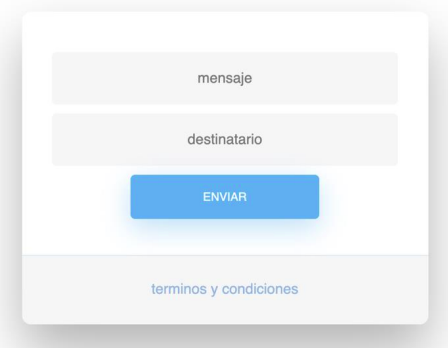

# Wakie-talkie

EJERCICIO:
En la siguiente actividad crearás una simple aplicación en línea, la cual imita la forma en que funciona un
walkie-talkie. Ésta tiene una interfaz que permite ingresar dos entradas, siendo la primera un mensaje, y la
segunda el destinatario de dicho mensaje.

